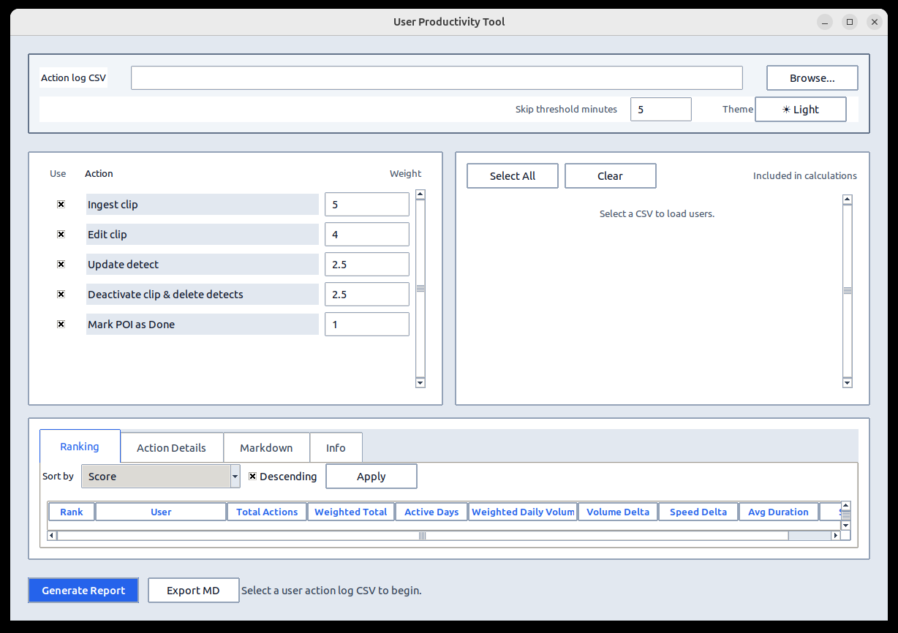
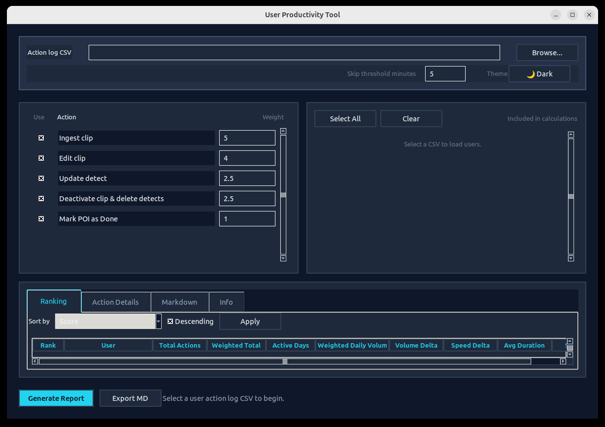

# User Productivity Tool

A desktop GUI application for analyzing user action logs and generating productivity reports. The tool reads user activity CSV logs, calculates weighted productivity scores, and presents results through a clean, themed interface with sorting and filtering capabilities.


---

## Features

- **CSV Import**: Load user action log CSV files (comma, semicolon, tab, pipe delimited)
- **Productivity Scoring**: Weighted action scoring with configurable weights
- **User Filtering**: Select/deselect users to include in calculations
- **Action Management**: Enable/disable actions and adjust weights dynamically
- **Skip Threshold**: Filter out idle/gap time above a configurable threshold
- **Theming**: Light and dark themes with consistent color palettes
- **Background Processing**: Multithreaded CSV loading and report generation — UI stays responsive
- **Multiple Output Views**: Ranking table, action details, Markdown export, and info panel
- **Portable Windows Build**: Single-file executable with automatic Python installation support

---

## Screenshots

| Light Theme | Dark Theme |
|-------------|------------|
|  |  |

---

## Quick Start

### Windows (GUI)
1. Download `UserProductivityTool.exe` from the [Releases](https://github.com/shotlekov/user-productivity-tool/releases) page
2. Double-click to run — no installation required

### Linux / Development
```bash
# Clone the repository
git clone https://github.com/shotlekov/user-productivity-tool.git
cd user-productivity-tool

# Run the GUI
python3 user_productivity_tool.py --gui

# Or use the launcher
python3 launch_gui.py
```

### Command Line
```bash
python3 user_productivity_tool.py --input data.csv
python3 user_productivity_tool.py --input data.csv --threshold-minutes 5 --actions "Ingest clip,Edit clip"
```

---

## Building for Windows

The build script automatically installs Python if it's not already present:

```bat
build_windows_exe.bat
```

This will:
1. Download and install Python 3.14.7 (if missing)
2. Create a virtual environment with PyInstaller
3. Build a portable `dist\UserProductivityTool.exe`

See [WINDOWS_BUILD.md](WINDOWS_BUILD.md) for detailed instructions.

---

## CSV Format

The tool expects columns for:
- **Day**: Date in `DD.MM.YYYY` or `YYYY-MM-DD` format
- **Hour**: Time in `HH:MM:SS` or `HH:MM` format
- **Username**: User identifier (rows with "system" are automatically skipped)
- **Action**: The action performed (e.g., "Ingest clip", "Edit clip")

Example:
```
day,hour,username,action
2024-01-15,09:00:00,alice,Ingest clip
2024-01-15,09:15:00,alice,Edit clip
2024-01-15,10:30:00,bob,Update detect
```

See `sample.csv` for a complete example.

---

## CLI Options

| Option | Description | Default |
|--------|-------------|---------|
| `--gui` | Launch GUI (default if no args) | N/A |
| `--input` | Path to input CSV | – |
| `--threshold-minutes` | Skip threshold for idle time | `5` |
| `--actions` | Comma-separated list of actions to include | All default actions |
| `--weight` | Custom weight for an action (`action=weight`) | Default weights |
| `--users` | Comma-separated list of users to include | All users |
| `--output` | Output directory for reports | Current directory |
| `--format` | Output format: `md`, `txt` | `md` |

---

## GUI Layout

The interface consists of:

1. **Input Card**: CSV file selection, skip threshold, theme toggle
2. **Action Weights Card**: Enable actions and set weights
3. **Users Card**: Select/deselect users with bulk select/clear
4. **Results Tabs**:
   - **Ranking**: Sorted productivity scores per user per action
   - **Action Details**: Full breakdown of calculated metrics
   - **Markdown**: Full Markdown report output
   - **Info**: Tool documentation and logic reference
5. **Bottom Bar**: Generate Report, Export Markdown, status updates

---

## Requirements

- **Python**: 3.10+
- **tkinter**: Included with Python on Windows/macOS; install via package manager on Linux:
  ```bash
  sudo apt install python3-tk  # Ubuntu/Debian
  ```

---

## Project Structure

```
.
├── user_productivity_tool.py    # Main application (GUI + CLI)
├── build_windows_exe.bat        # Windows build script (auto-installs Python)
├── requirements-build.txt       # PyInstaller (build-time only)
├── WINDOWS_BUILD.md             # Windows build documentation
├── launch_gui.py                # Linux desktop launcher
├── user-productivity-tool.desktop  # Linux desktop entry
├── icon.png                     # Application icon
├── sample.csv                   # Sample data for testing
├── test_app_methods.py          # Test utilities
└── test_user_productivity_tool.py  # Unit tests
```

---

## License

This project is open source and available for personal and commercial use.

---

## Repository

https://github.com/shotlekov/user-productivity-tool
